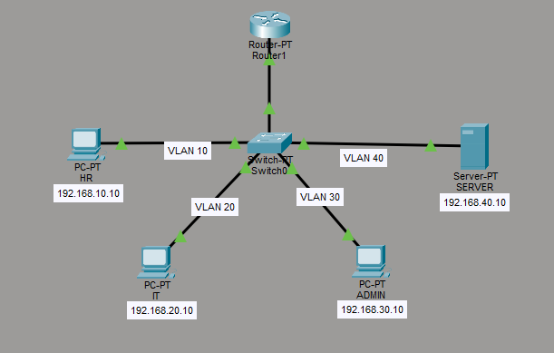
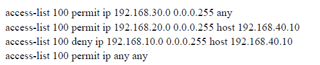
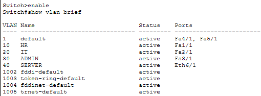
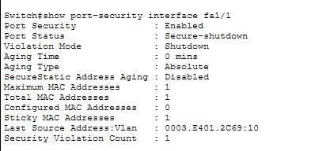

# network-security-lab
VLAN Segmentation, DHCP, ACL &amp; Attack Simulation Project
# 🔐 Network Security Lab – VLAN, DHCP, ACL & Attack Simulation

## 📌 Project Overview

This project demonstrates the design and implementation of a **secure enterprise-style network** using segmentation, routing, and security controls. It includes both **configuration and attack simulation**, showcasing defensive networking skills.

---

## 🎯 Objectives

* Design a segmented network using VLANs
* Implement dynamic IP allocation using DHCP
* Enable inter-VLAN communication using router-on-a-stick
* Apply Access Control Lists (ACL) for traffic filtering
* Simulate real-world network attacks
* Implement Layer 2 security using port security

---

## 🏗️ Network Architecture

* **VLAN 10** → HR Department
* **VLAN 20** → IT Department
* **VLAN 30** → Admin Department
* **VLAN 40** → Server Network

✔ Router used for inter-VLAN routing
✔ Switch used for VLAN segmentation

---

## 🛠️ Tools & Technologies

* Cisco Packet Tracer
* VLAN (Virtual LAN)
* DHCP (Dynamic Host Configuration Protocol)
* ACL (Access Control List)

---

## 🔐 Security Implementations

### 1. Access Control List (ACL)

* HR ❌ denied access to Server
* IT ✅ allowed limited access
* Admin ✅ full access

### 2. Port Security

* Sticky MAC enabled
* Max 1 device per port
* Violation mode → Shutdown

### 3. Server Isolation

* Dedicated VLAN (VLAN 40)
* Static IP configuration
* HTTP service enabled

---

## ⚠️ Attack Simulations

### 🔴 Rogue Device Attack

* Unauthorized device connected
* MAC mismatch detected
* Port automatically shut down

### 🔴 DHCP Starvation Attack

* Multiple fake clients request IPs
* DHCP pool exhausted
* New devices unable to connect

---

## 📊 Results & Validation

| Test Case                | Result                          |
| ------------------------ | ------------------------------- |
| DHCP Configuration       | ✅ Successful                    |
| Inter-VLAN Communication | ✅ Working                       |
| ACL Enforcement          | ✅ Working                       |
| Server Access Control    | ✅ Secured                       |
| Port Security            | ✅ Blocking unauthorized devices |
| Attack Simulation        | ✅ Detected & Mitigated          |

---

## 📄 Project Report

📥 [Download Full Report](./Network_project_report.pdf)

---

## 🚀 Future Enhancements

* IDS/IPS implementation
* Firewall integration
* Real-time monitoring
* Wireshark & Snort analysis
* DHCP Snooping & Dynamic ARP Inspection

---

## ⚠️ Limitations

* Simulated environment (Cisco Packet Tracer)
* Limited attack scenarios
* Not tested on real hardware

---

## 👨‍💻 Author

**Ramesh G**
Cybersecurity Student

---

## ⭐ Key Learning Outcome

This project demonstrates **practical network security skills**, including segmentation, access control, and attack mitigation—core concepts required for real-world cybersecurity roles.
